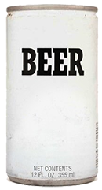

_Preliminary, experimental, incomplete, undocumented, and generally unsuitable for anything. Expect everything to change._

# zero-elements

Generic components that have zero dependencies. Generic, like Beer.

Most of these components are Custom Elements, so they do depend on bits of the Web Components standard platform itself. Specifically, CustomElements and HTMLImports feature support is expected.

These features are natively available in Chrome, and otherwise supported by [web-componentsjs polyfills](https://github.com/webcomponents/webcomponentsjs). These elements do not depend on ShadowDOM, so [webcomponents-lite](https://polygit.org/components/webcomponentsjs/webcomponents.min.js) is sufficient.

